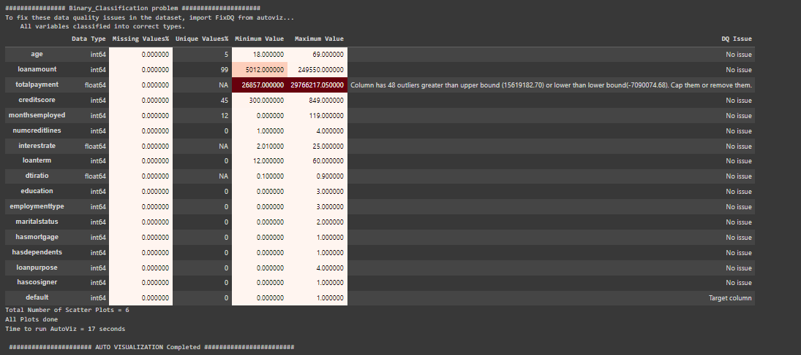
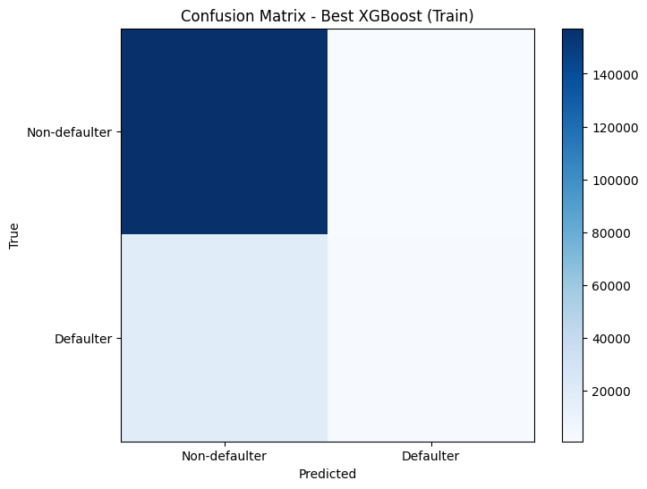
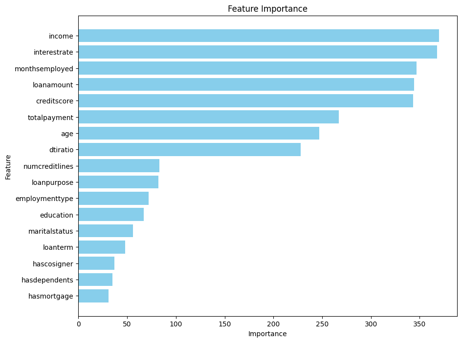
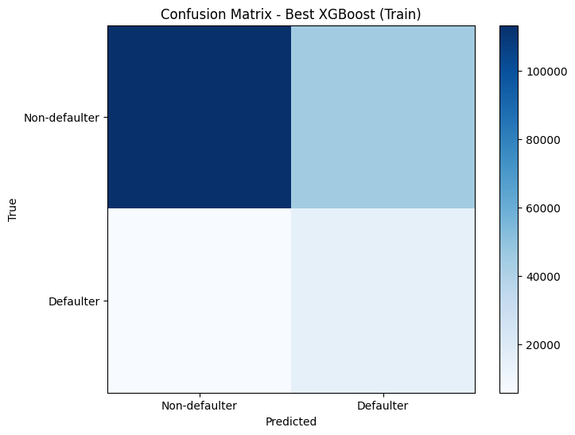
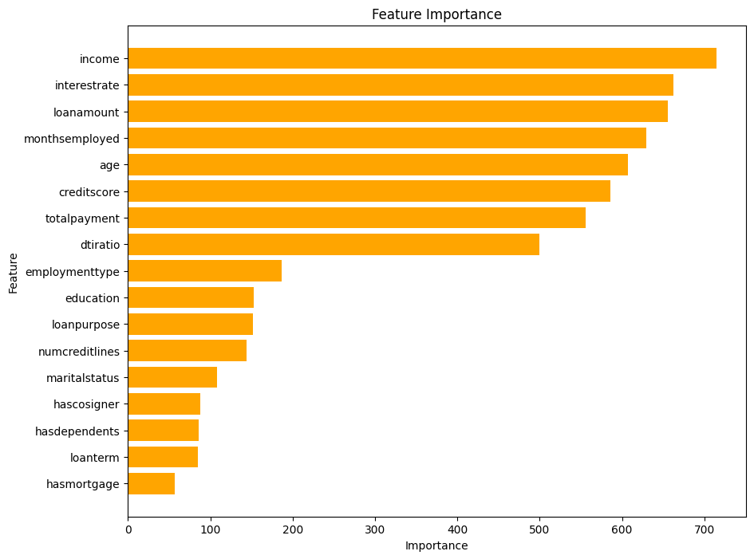

🏦 **Loan Prediction Model**

This machine learning project aims to build a model that predicts whether a person would default on a loan.

📊 **Dataset**
Find the dataset used [here](https://www.kaggle.com/datasets/nikhil1e9/loan-default/data).

🚀 **Approach**
### 1. Initial Steps
- The dataset initially has 18 columns and 255,347 rows of data.
- The `LoanID` column is unnecessary, so it was dropped:
  ```python
  df.drop("loanid", axis=1, inplace=True)
  ```
- Renamed column headers to lowercase and replaced spaces with underscores:
  ```python
  df.columns = df.columns.str.lower().str.replace(' ', '_')
  ```
- The target column is the `default` column, marked as 0 for non-defaulters and 1 for defaulters.

### 2. Exploratory Data Analysis (EDA)
#### A. Numerical Columns Processes
- Performed descriptive analysis using `df.describe()`.
- Identified outliers using the Interquartile Range (IQR) formula: `IQR = Q3 - Q1`.
- Visualized data distributions with boxplots and histograms.
- Analyzed correlations with the target column.
- Plotted a histogram and pie chart for default status distribution:
  

Other considerations:
- [Skewness and Kurtosis](https://www.datacamp.com/tutorial/understanding-skewness-and-kurtosis).
- [Benford's Law](https://en.wikipedia.org/wiki/Benford%27s_law).

#### B. Categorical Columns Processes
- Defined `cat_columns` for categorical data:
  ```python
  cat_columns = ['education', 'employmenttype', 'maritalstatus', 'hasmortgage', 'hasdependents', 'loanpurpose', 'hascosigner']
  ```
- Created contingency tables and performed Chi-square tests for each categorical column.
- Visualized distributions with count plots:
  ```python
  for column in cat_columns:
      plt.figure(figsize=(10, 6))
      sns.countplot(data=df, x=column, hue='default')
      plt.title(f"Distribution of {column} by Default Status")
      plt.xlabel(column)
      plt.ylabel('Count')
      plt.legend(title='Default')
      plt.show()
  ```

#### C. Feature Engineering
- Added `totalpayment` column:
  ```python
  df['totalpayment'] = df['loanamount'] * (1 + df['interestrate'] / 100) * df['loanterm'] / 12
  ```
- Visualized distribution of `totalpayment` and its correlation with the target column.

#### D. Multivariate Analysis
- Visualized correlations among columns:
  

#### E. Automated EDA
- Used AutoViz for enhanced visualization:
  

### 📈 **Conclusions from the EDA**

#### Numerical Columns:
1. **Outliers and Distribution:**
   - No outliers detected. Uniform distribution without missing values.

2. **Correlation with 'default' Column:**
   - Weak negative correlations with 'age', 'income', 'creditscore', and 'monthsemployed'.
   - Weak positive correlations with 'loanamount', 'numcreditlines', 'interestrate', 'loanterm', and 'dtiratio'.

3. **Feature Engineering- Total Payment Column:**
   - Introduced the 'totalpayment' column which is obtained from the formula: totalpayment= loanamount*(1+interestrate)*(loanterm/12)

4. **Multivariate Analysis:**
   - Significant correlations observed between 'totalpayment' and 'loanamount', 'interestrate', 'loanterm'.

#### Categorical Columns:
1. **Education:** Higher education levels correlate with lower default rates.
2. **Employment Type:** Unemployed individuals are more likely to default.
3. **Marital Status:** Married individuals show a lower default risk.
4. **Has Mortgage:** Applicants with mortgages have a lower default probability.
5. **Has Dependents:** Individuals with dependents are less likely to default.
6. **Loan Purpose:** Business loans have a higher default likelihood.
7. **Has Cosigner:** Applicants with cosigners present a lower default risk.
8. **Statistical Significance:** Categorical columns exhibited significant associations with the 'default' column.
9. **Chi-Square Analysis:** Supported substantial differences in frequencies, suggesting associations beyond chance.

### **Default Column Analysis:**
- 29,653 defaulters (11.6%) and 225,694 non-defaulters (88.4%) in the dataset. This distribution could introduce bias, favoring identification of non-defaulters.

### **Overall Analysis on Categorical Columns:**
Individuals who are full-time employed, highly educated, and have responsibilities such as dependents and mortgages are less likely to default on loans.


🔄 **Modeling**


## 📊 **Data Preprocessing**


### Data Preprocessing Steps:
1. **Splitting Data**:
   - Divided the dataset into independent columns `X = df.drop('default', axis=1)` and the dependent column `y = df['default']`.
   - Used scikit-learn to split the dataset into 70% train and 30% test:
     ```python
     from sklearn.model_selection import train_test_split
     X_train, X_test, y_train, y_test = train_test_split(X, y, test_size=0.3, random_state=42)
     ```

2. **Encoding and Scaling**:
   - Utilized `TargetEncoder` to encode categorical variables and `MinMaxScaler` to scale numerical variables:
     ```python
     from sklearn.compose import ColumnTransformer
     from category_encoders import TargetEncoder
     from sklearn.preprocessing import MinMaxScaler

     categorical_variables = ['education', 'employmenttype', 'maritalstatus', 'hasmortgage', 'hasdependents', 'loanpurpose', 'hascosigner']
     numerical_variables = ['age', 'income', 'loanamount', 'creditscore', 'monthsemployed', 'numcreditlines', 'interestrate', 'loanterm', 'dtiratio']

     preprocessor = ColumnTransformer(transformers=[
         ('te', TargetEncoder(min_samples_leaf=1, smoothing=10), categorical_variables),
         ('scaler', MinMaxScaler(), numerical_variables)
     ], remainder="passthrough", verbose_feature_names_out=False).set_output(transform="pandas")
     ```

3. **Saving the Preprocessor**:
   - Saved the preprocessor to a pickle file for use during inference:
     ```python
     import pickle

     with open('preprocessor.pkl', 'wb') as file:
         pickle.dump(preprocessor, file)
     ```

By following these preprocessing steps, the dataset is ready for building robust and scalable machine learning models. 🎯


## 🔧 **Model Training**

In this section, we will explore and train the following models/algorithms:
1. 🌳 **RandomForest Classifier**
2. 📈 **Logistic Regression**
3. 🌟 **Extreme Gradient Boosting (XGB) Classifier**
4. 🤝 **K-Nearest Neighbors (KNN)**
5. 🧠 **Gaussian Naive Bayes (GaussianNB)**
6. 🐱 **CatBoostClassifier**

```python
models = {
    'RandomForest Classifier': RandomForestClassifier(random_state=42),
    'Logistic Regression': LogisticRegression(random_state=42),
    'Extreme Gradient Boosting (XGB) Classifier': XGBClassifier(random_state=42),
    'K-Nearest Neighbors (KNN)': KNeighborsClassifier(),
    'Gaussian Naive Bayes (GaussianNB)': GaussianNB(),
    'CatBoostClassifier': CatBoostClassifier(random_state=42, verbose=0)  # Adjust verbosity as needed
}
```

### 🏋️ **Training the Models**
1. **Without Using Class Weights** on all models.
2. **Using Class Weights** on models that support it due to the imbalance in the target 'default' column (11.6% positive class). These models include: `RandomForestClassifier`, `Logistic Regression`, `XGBClassifier` (using `scale_pos_weight`), and `CatBoostClassifier`.

### 📊 **Performance Metrics**
We will evaluate the models based on their **accuracy**, **recall**, **precision**, and **F1 score** to choose the best model.

#### 💼 **Business Context for KaGil Lenders (the non-existent client):**
1. **Dataset**: 255,347 records collected over three years.
2. **Primary Income Source**: Lending.
3. **Objective**: Reduce the number of loan defaulters.

Given the model's likely better performance at identifying the negative class (non-defaulters), we focus on improving performance for the positive class (defaulters), aligning with the company’s priorities.

**Precision, Recall, and F1 Score**
- **Precision**: Higher precision means fewer False Positives, reducing the likelihood of incorrectly classifying a non-defaulter as a defaulter.
- **Recall**: Higher recall means fewer False Negatives, reducing the likelihood of incorrectly classifying a defaulter as a non-defaulter.

#### 📝 **Company's Decision**
KaGil Lenders prioritize minimizing loan defaults over maximizing profits. However, caution is necessary to avoid misclassifying good borrowers as defaulters.

### 🔍 **Summary of Training Without Applying Class Weights**
XGBoost demonstrates a balanced performance:
1. **Recall**: 8.57% (second highest after GaussianNB at 11.02%).
2. **Precision**: 56.09% (fourth highest).
3. **F1 Score**: 14.87% (second highest after GaussianNB's 16.39%).
4. **Accuracy**: 88.57% (second highest after CatBoost at 88.61%).

### 🔍 **Summary When Applying Class Weights**
Applying class weights results in significant improvements in recall:
1. **CatBoost**: Balanced F1 score of 34.45%, second highest precision at 23.73% (after Random Forest at 64%), second highest recall at 62.84% (after Logistic Regression at 67.65%).
2. **Accuracy**: 72.14% (second highest after Random Forest at 88.49%).

### 🏆 **Overall Summary on Model Training and Evaluation**
1. **Without Class Weights**: High precision (31% to 63%) and highest accuracies (86% to 88%). XGBoost preferred given KaGil Lenders' business model.
2. **With Class Weights**: Increased recall (2.63% to 69.25%). CatBoost preferred for reducing defaults while considering profitability.

### 🔧 **Hyperparameter Tuning**
- Decided to tune XGBoost Model for its good performance with and without class weights.

**Fine-tuning XGBoost Without Applying Class Weights**:
- Precision: 67.94%
- Recall: 8.91%
- F1 Score: 15.75%




**Fine-tuning XGBoost With Class Weights**:
- Precision: 25.05%
- Recall: 72.13%
- F1 Score: 37.18%





